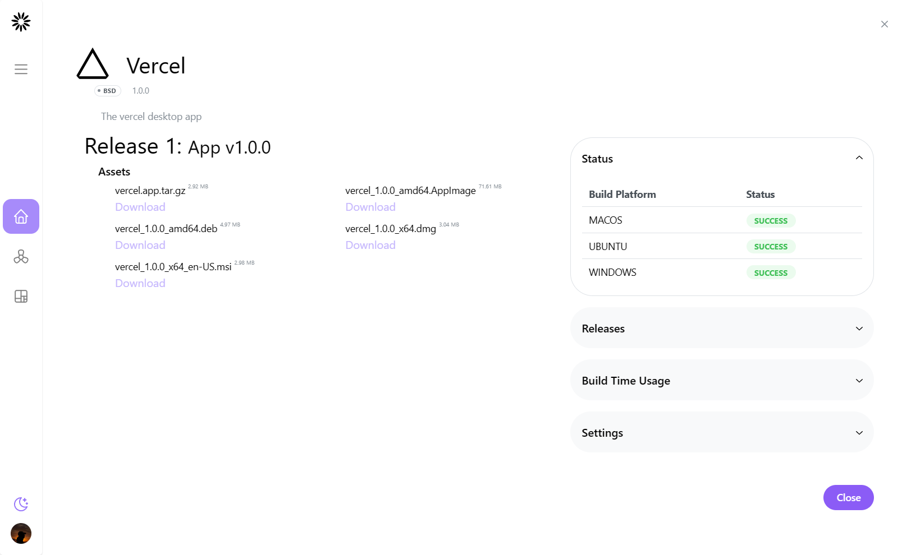

# Limitss 
<p align="center">
    
</p>

The Open Source Desktop App Builder.
<p align="center">
    
</p>

## Introduction

Limitss is an open-source project designed to empower developers and non-developers alike to effortlessly create native desktop applications from their web apps. 

Inspired by the vision of providing an alternative to the YC backed todesktop.com, and others, Limitss strives to offer a seamless experience, granting users the ability to build desktop applications without the need for extensive coding or developer expertise.

## Key Features

Limitss breaks down barriers, allowing you to transform your web app into a native desktop application swiftly and efficiently. Gain user trust like never before by delivering a desktop experience that goes beyond the limits.

### Explore the Solutions

Limitss provides a powerful suite of features to streamline the desktop app creation process. From the core framework to essential tools, our platform ensures you have everything you need to bring your app to the desktop.

#### Blazing Fast Performance

Utilizing cutting-edge technologies and stepping away from resource-intensive browsers, Limitss ensures your app loads instantly and performs like a native application. Experience dramatically reduced RAM and CPU usage for a smoother user experience.

#### Safe and Secure

Limitss takes security seriously. The app is sandboxed and fortified against malicious code, offering enhanced protection compared to conventional browser-based applications. Enjoy a 70% increase in safety, particularly against memory safety-related attacks.

#### Small Bundle Size

Optimization is key, and Limitss excels in keeping bundle sizes to a minimum. With a bundle size of less than 10MB, distributing your app becomes quick and easy. End users can effortlessly try and install your application without unnecessary delays.

## Getting Started

To start building your native desktop app with Limitss, check out [limitss](https://limitss.com) for detailed instructions and examples. Join our community on [GitHub](link-to-github) to collaborate, share ideas, and contribute to the growth of Limitss.

Transform your web app into a powerful desktop experience with Limitss - Where There Are No Limits!
## Development 

First, run the development server:

```bash
npm run dev
# or
yarn dev
```

Open [http://localhost:3000](http://localhost:3000) with your browser to see the result.

You can start editing the page by modifying `pages/index.tsx`. The page auto-updates as you edit the file.

[API routes](https://nextjs.org/docs/api-routes/introduction) can be accessed on [http://localhost:3000/api/hello](http://localhost:3000/api/hello). This endpoint can be edited in `pages/api/hello.ts`.

The `pages/api` directory is mapped to `/api/*`. Files in this directory are treated as [API routes](https://nextjs.org/docs/api-routes/introduction) instead of React pages.

### Learn More

To learn more about Next.js, take a look at the following resources:

- [Next.js Documentation](https://nextjs.org/docs) - learn about Next.js features and API.
- [Learn Next.js](https://nextjs.org/learn) - an interactive Next.js tutorial.

You can check out [the Next.js GitHub repository](https://github.com/vercel/next.js/) - your feedback and contributions are welcome!

### Deploy on Vercel

The easiest way to deploy your Next.js app is to use the [Vercel Platform](https://vercel.com/new?utm_medium=default-template&filter=next.js&utm_source=create-next-app&utm_campaign=create-next-app-readme) from the creators of Next.js.

Check out our [Next.js deployment documentation](https://nextjs.org/docs/deployment) for more details.
## License
MIT
